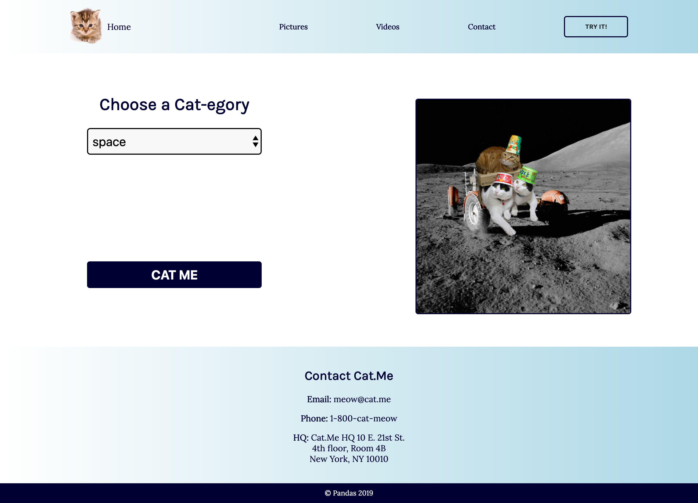

# Feisty Chonkers on Demand
You've been hired by Cat.me, the world's most purrr-fect tech startup to build out the landing page for their hot new app. They'd like you to build out a two page web app that matches the wireframes and specifications provided below.

## Getting Started
Fork and clone this repository. The HTML of both pages has been provided for you. You will need to provide the CSS and Javascript.

## HTML Notes
Although the HTML has been provided for you, you should still begin there. Carefully review the structure of the page and take note of the `id` and `class` names being used, as you will need to select them in your CSS and JS.

## Video Section Notes
Making videos responsive to different screen sizes is incredibly difficult. Because of this, we've provided both the HTML and CSS required to make this happen. Take note of how it works, and make sure to save this somewhere in case you ever need to have videos on a future responsive website. 

We used [this site's explanation](https://www.ostraining.com/blog/coding/responsive-videos/) as a guide.

## JS Notes
- We're using [The Cat API](https://thecatapi.com/) for this app. Detailed documention for this API can be found at https://docs.thecatapi.com/.
- This API requires an API key, which is kind of like a password. You can get your free API key by signing up.
- You'll find information about using the API key in your axios call here: https://docs.thecatapi.com/authentication. We've also provided base code in your JS file to help you get it right.
- You'll need to make **TWO API calls**.
  - The first call should occur the second the page loads, and it should populate the `select` dropdown with the categories by using the following endpoint: https://api.thecatapi.com/v1/categories. 
  - When you add the resulting categories to the DOM, you'll need to use both the category id and the category name: `dropdown.innerHTML += `<option id=${categories[i].id}>${categories[i].name}</option>``
  - The second call should grab the selected category id and make a new API call to get a cat photo that uses that id as a parameter. This axios call should hit the `https://api.thecatapi.com/v1/images/search?category_ids=${categoryId}` endpoint.
  - Getting the value of the `id` of a selected option from a dropdown menu is TOUGH, so we'll help you out here: `const categoryId = dropdown[dropdown.selectedIndex].id`
  
## Bonus
- Turn the header into a "fixed header" using positioning.
- Add hover psuedoclasses to your links or other elements on the page.
- Animate the "Get Started" and/or "Try It!" button(s) using CSS Animations.
- Follow the steps to host your app on [Surge](https://surge.sh/)
- Make your social sharing look as cute as a kitten by adding social meta tags to the `<head>` section of your `index.html` page. [This guide can help](https://css-tricks.com/essential-meta-tags-social-media/).

## Page One Wireframe

## Page Two Wireframe

